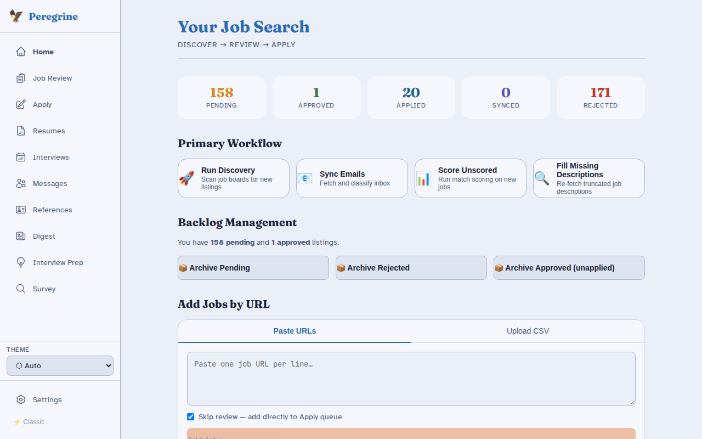
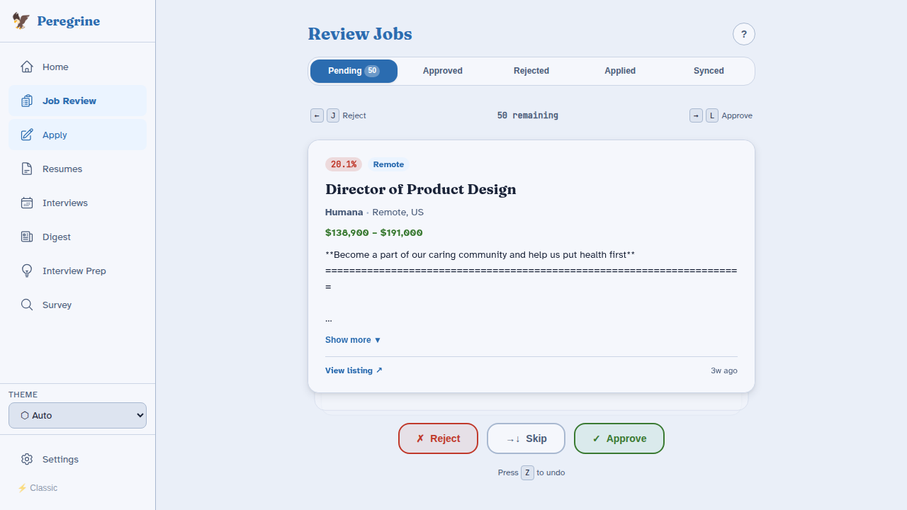
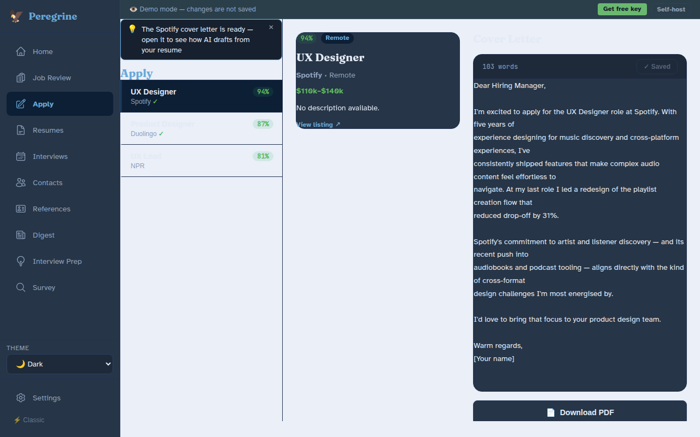
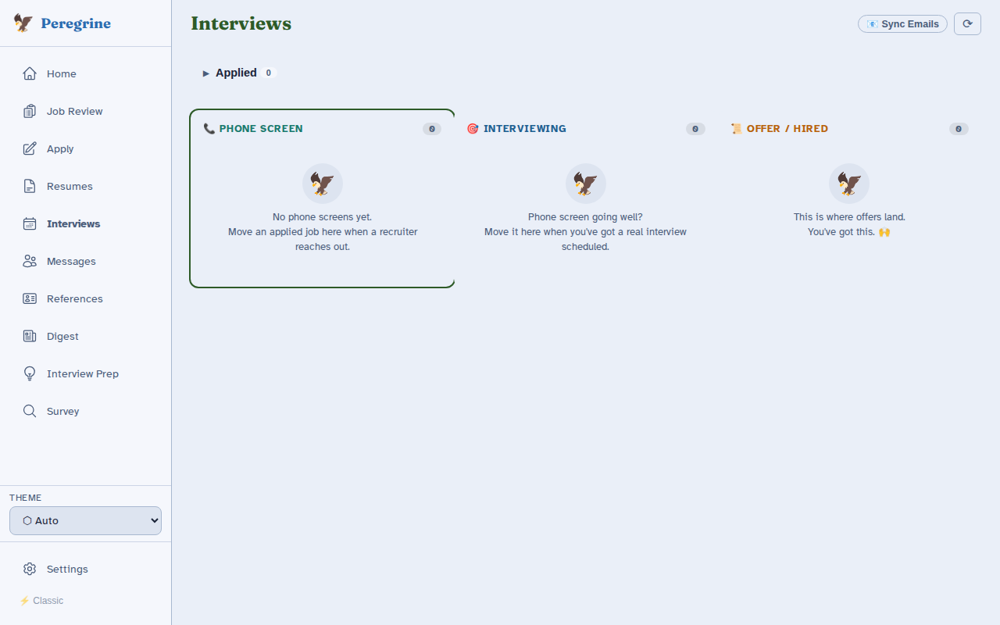

<div align="center">
  

  <h1>Peregrine</h1>

  <p><strong>Job search pipeline — by <a href="https://circuitforge.tech">Circuit Forge LLC</a></strong></p>

  <p><em>AI for the tasks the system made hard on purpose.</em></p>

  [](#license)
  [](https://github.com/CircuitForgeLLC/peregrine/actions/workflows/ci.yml)
  [](https://docs.circuitforge.tech/peregrine/)
  [](https://git.opensourcesolarpunk.com/Circuit-Forge/peregrine/releases)

  <p>
    <a href="https://demo.circuitforge.tech/peregrine"><strong>Live Demo</strong></a> —
    no account required, nothing saved &nbsp;|&nbsp;
    <a href="https://docs.circuitforge.tech/peregrine/">Docs</a> &nbsp;|&nbsp;
    <a href="https://git.opensourcesolarpunk.com/Circuit-Forge/peregrine/issues">Issues</a>
  </p>

  <blockquote>
    <strong>Primary development</strong> happens at
    <a href="https://git.opensourcesolarpunk.com/Circuit-Forge/peregrine">git.opensourcesolarpunk.com/Circuit-Forge/peregrine</a>.
    GitHub and Codeberg are push mirrors. Issues and PRs are welcome on any platform.
  </blockquote>
</div>

---

<table>
<tr>
<td></td>
<td></td>
</tr>
<tr>
<td></td>
<td></td>
</tr>
</table>

---

## Why Peregrine?

Job search is a second job nobody hired you for. ATS (applicant tracking system) filters designed to reject. Boards that show the same listing eight times. Cover letter number forty-seven for a role that might already be filled. Hours of prep for a phone screen that lasts twelve minutes.

- **Handles the full pipeline.** Discover, filter, match, draft, track — one tool, one database, no duct tape.
- **LLM is optional and local-first.** Discovery and tracking work with no LLM at all. When you do configure one, it runs on your hardware by default. Cloud inference is a fallback, not the default path.
- **Ghost-post detection baked in.** Listings that have been open too long or look like sourcing traps get flagged before you spend time on them.
- **Human approval at every step.** LLM drafts cover letters and research briefs; you approve before anything goes anywhere. Peregrine never submits an application on your behalf.
- **Privacy · Safety · Accessibility** are architectural constraints, not aspirational copy. No PII (personally identifiable information) logging, no behavioral profiling, no dark patterns.

---

## Quick Start

One-line install:

```bash
bash <(curl -fsSL https://git.opensourcesolarpunk.com/Circuit-Forge/peregrine/raw/branch/main/install.sh)
```

Or clone and run manually:

```bash
git clone https://git.opensourcesolarpunk.com/Circuit-Forge/peregrine
cd peregrine
./manage.sh setup
./manage.sh start
```

Open **http://localhost:8502** — the setup wizard walks you through the rest.

> **macOS / Apple Silicon:** install Ollama natively via Homebrew before starting for Metal GPU-accelerated inference. `install.sh` handles this automatically.
> **Windows:** use WSL2 with Ubuntu.

### Inference profiles

```bash
./manage.sh start                       # remote — no GPU; LLM calls go to Anthropic / OpenAI
./manage.sh start --profile cpu         # local Ollama on CPU (or Metal via native Ollama on macOS)
./manage.sh start --profile single-gpu  # Ollama + vision on GPU 0 (NVIDIA only)
./manage.sh start --profile dual-gpu    # Ollama + vLLM on two NVIDIA GPUs
```

---

## Features

| Feature | Tier |
|---------|------|
| Job discovery — LinkedIn, Indeed, Glassdoor, Adzuna, The Ladders | Free |
| Ghost-post detection | Free |
| Resume keyword matching and gap analysis | Free |
| Document storage sync (Google Drive, Dropbox, OneDrive, Nextcloud) | Free |
| Webhook notifications (Discord, Home Assistant) | Free |
| Vue 3 SPA — full UI with onboarding wizard, job board, apply workspace, interview kanban | Free |
| **Cover letter generation** | Free with LLM ¹ |
| **Company research briefs** | Free with LLM ¹ |
| **Interview prep and practice Q&A** | Free with LLM ¹ |
| **Survey assistant** (culture-fit Q&A, screenshot analysis) | Free with LLM ¹ |
| Managed cloud LLM (no API key needed) | Paid |
| Email sync and auto-classification | Paid |
| Job tracking integrations (Notion, Airtable, Google Sheets) | Paid |
| Calendar sync (Google, Apple) | Paid |
| Slack notifications | Paid |
| CircuitForge shared cover-letter model | Paid |
| **Voice guidelines** (custom writing style and tone) | Premium with LLM ¹ |
| Cover letter model fine-tuning — your writing, your model | Premium |
| Multi-user support | Premium |
| Human-in-the-loop operator (CAPTCHAs, phone calls, wet signatures) | Ultra |

¹ **BYOK (bring your own key) unlock:** configure any LLM backend — a local [Ollama](https://ollama.com) or vLLM instance, or your own API key (Anthropic, OpenAI-compatible) — and all "Free with LLM" and "Premium with LLM" features unlock at no charge.

---

## What Peregrine does not do

Peregrine does **not** submit job applications for you. You still click apply on the employer's site.

This is intentional. Automated mass-applying is a bad experience for everyone and a trust violation with employers who posted a real role. The submit button is yours. The rest of the grind is ours.

---

## Stack

| Layer | Technology |
|-------|-----------|
| Frontend | Vue 3 SPA (Vite) |
| Backend | FastAPI + Python |
| Database | SQLite (local, per-user) |
| Job scraping | [JobSpy](https://github.com/Bunsly/JobSpy) + custom board scrapers |
| LLM inference | Ollama, vLLM, Anthropic, OpenAI-compatible — configurable fallback chain |
| Vision | moondream2 (survey screenshot analysis) |
| Container | Docker / Podman |

---

## manage.sh reference

```
./manage.sh setup               Install Docker/Podman + NVIDIA toolkit
./manage.sh start [--profile P] Preflight check then start services
./manage.sh stop                Stop all services
./manage.sh restart             Restart all services
./manage.sh status              Show running containers
./manage.sh logs [service]      Tail logs (default: app)
./manage.sh update              Pull latest images and rebuild app container
./manage.sh test                Run test suite
./manage.sh prepare-training    Scan docs for cover letters — outputs training JSONL
./manage.sh finetune            Run LoRA fine-tune (requires single-gpu profile or higher)
./manage.sh open                Open the web UI in your browser
```

---

## Documentation

Full docs at **[docs.circuitforge.tech/peregrine](https://docs.circuitforge.tech/peregrine)**

Bug reports and feature requests: [Forgejo issues](https://git.opensourcesolarpunk.com/Circuit-Forge/peregrine/issues)

---

## Contributing

Contributions are welcome. The discovery pipeline — scrapers, board integrations, matching logic — is MIT-licensed. Fork it, extend it, send PRs. AI features are BSL 1.1. See the [contributing guide](https://docs.circuitforge.tech/peregrine/developer-guide/contributing/) for conventions.

---

## License

Peregrine uses a split license:

| Component | License |
|-----------|---------|
| Discovery pipeline — scrapers, matching, tracking | [MIT](LICENSE-MIT) |
| LLM features — cover letter generation, company research, interview prep, survey assistant, fine-tuning | [BSL 1.1](LICENSE-BSL) — free for personal non-commercial self-hosting; commercial use or SaaS re-hosting requires a paid license; converts to MIT after four years |

Fine-tuned model weights are proprietary and per-user — not redistributable.

---

Humans own design, architecture, code review, testing, and verification. LLMs are part of our development workflow. [Our positions on LLM use →](https://circuitforge.tech/positions)

© 2026 Circuit Forge LLC
