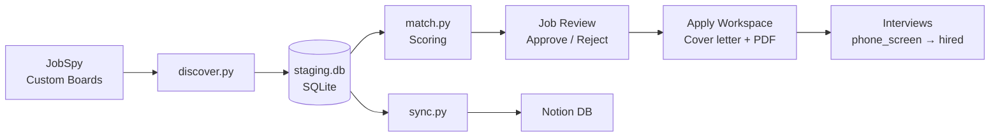
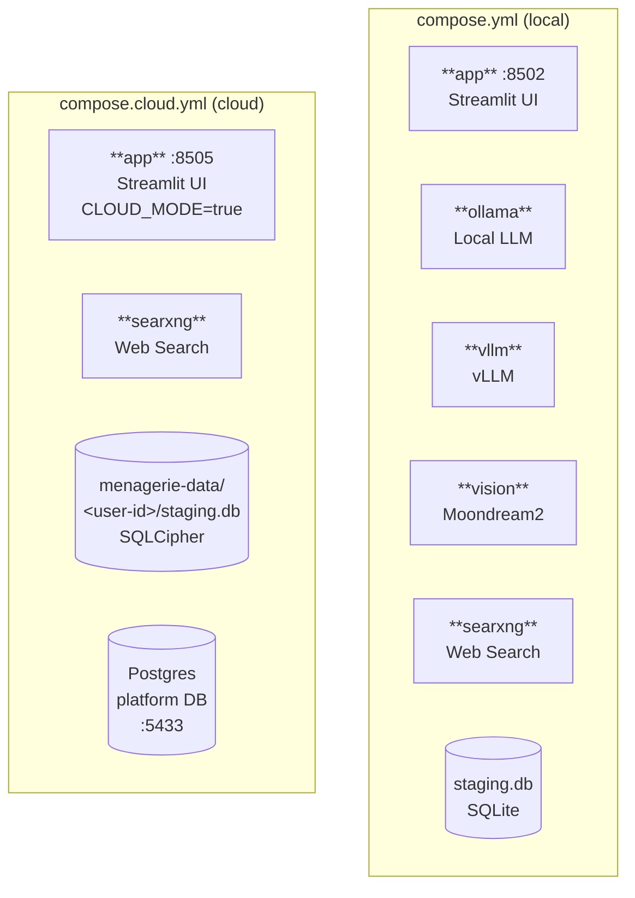
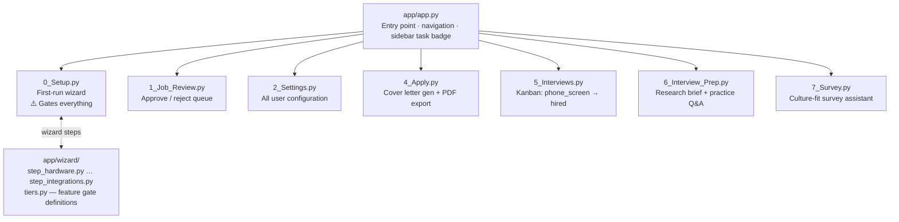
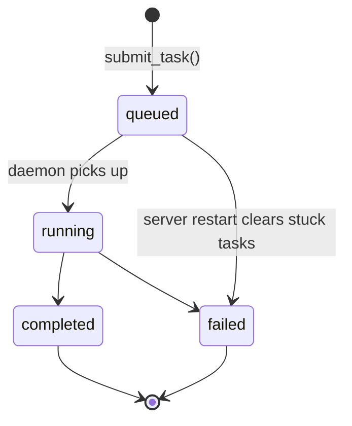

# Architecture

This page describes Peregrine's system structure, layer boundaries, and key design decisions.

---

## System Overview

### Pipeline



### Docker Compose Services

Three compose files serve different deployment contexts:

| File | Project name | Port | Purpose |
|------|-------------|------|---------|
| `compose.yml` | `peregrine` | 8502 | Local self-hosted install (default) |
| `compose.demo.yml` | `peregrine-demo` | 8504 | Public demo at `demo.circuitforge.tech/peregrine` — `DEMO_MODE=true`, no LLM |
| `compose.cloud.yml` | `peregrine-cloud` | 8505 | Cloud managed instance at `menagerie.circuitforge.tech/peregrine` — `CLOUD_MODE=true`, per-user data |



Solid lines = always connected. Dashed lines = optional/profile-dependent backends.

### Streamlit App Layer



### Scripts Layer

Framework-independent — no Streamlit imports. Can be called from CLI, FastAPI, or background threads.

| Script | Purpose |
|--------|---------|
| `discover.py` | JobSpy + custom board orchestration |
| `match.py` | Resume keyword scoring |
| `db.py` | All SQLite helpers (single source of truth) |
| `llm_router.py` | LLM fallback chain |
| `generate_cover_letter.py` | Cover letter generation |
| `company_research.py` | Pre-interview research brief |
| `task_runner.py` | Background daemon thread executor |
| `imap_sync.py` | IMAP email fetch + classify |
| `sync.py` | Push to external integrations |
| `user_profile.py` | `UserProfile` wrapper for `user.yaml` |
| `preflight.py` | Port + resource check |
| `custom_boards/` | Per-board scrapers |
| `integrations/` | Per-service integration drivers |
| `vision_service/` | FastAPI Moondream2 inference server |

### Config Layer

Plain YAML files. Gitignored files contain secrets; `.example` files are committed as templates.

| File | Purpose |
|------|---------|
| `config/user.yaml` | Personal data + wizard state |
| `config/llm.yaml` | LLM backends + fallback chains |
| `config/search_profiles.yaml` | Job search configuration |
| `config/resume_keywords.yaml` | Scoring keywords |
| `config/blocklist.yaml` | Excluded companies/domains |
| `config/email.yaml` | IMAP credentials |
| `config/integrations/` | Per-integration credentials |

### Database Layer

**Local mode** — `staging.db`: SQLite, single file, gitignored.

**Cloud mode** — Hybrid:

- **Postgres (platform layer):** account data, subscriptions, telemetry consent. Shared across all users.
- **SQLite-per-user (content layer):** each user's job data in an isolated, SQLCipher-encrypted file at `/devl/menagerie-data/<user-id>/peregrine/staging.db`. Schema is identical to local — the app sees no difference.

#### Local SQLite tables

| Table | Purpose |
|-------|---------|
| `jobs` | Core pipeline — all job data |
| `job_contacts` | Email thread log per job |
| `company_research` | LLM-generated research briefs |
| `background_tasks` | Async task queue state |
| `survey_responses` | Culture-fit survey Q&A pairs |

#### Postgres platform tables (cloud only)

| Table | Purpose |
|-------|---------|
| `subscriptions` | User tier, license JWT, product |
| `usage_events` | Anonymous usage telemetry (consent-gated) |
| `telemetry_consent` | Per-user telemetry preferences + hard kill switch |
| `support_access_grants` | Time-limited support session grants |

---

### Cloud Session Middleware

`app/cloud_session.py` handles multi-tenant routing transparently:

```
Request → Caddy injects X-CF-Session header (from Directus session cookie)
        → resolve_session() validates JWT, derives db_path + db_key
        → all DB calls use get_db_path() instead of DEFAULT_DB
```

Key functions:

| Function | Purpose |
|----------|---------|
| `resolve_session(app)` | Called at top of every page — no-op in local mode |
| `get_db_path()` | Returns per-user `db_path` (cloud) or `DEFAULT_DB` (local) |
| `derive_db_key(user_id)` | `HMAC(SERVER_SECRET, user_id)` — deterministic per-user SQLCipher key |

The app code never branches on `CLOUD_MODE` except at the entry points (`resolve_session` and `get_db_path`). Everything downstream is transparent.

### Telemetry (cloud only)

`app/telemetry.py` is the **only** path to the `usage_events` table. No feature may write there directly.

```python
from app.telemetry import log_usage_event

log_usage_event(user_id, "peregrine", "cover_letter_generated", {"words": 350})
```

- Complete no-op when `CLOUD_MODE=false`
- Checks `telemetry_consent.all_disabled` first — if set, nothing is written, no exceptions
- Swallows all exceptions so telemetry never crashes the app

---

## Layer Boundaries

### App layer (app/)

The Streamlit UI layer. Its only responsibilities are:

- Reading from `scripts/db.py` helpers
- Calling `scripts/` functions directly or via `task_runner.submit_task()`
- Rendering results to the browser

The app layer does not contain business logic. Database queries, LLM calls, and integrations all live in `scripts/`.

### Scripts layer (scripts/)

This is the stable public API of Peregrine. Scripts are designed to be framework-independent — they do not import Streamlit and can be called from a CLI, FastAPI endpoint, or background thread without modification.

All personal data access goes through `scripts/user_profile.py` (`UserProfile` class). Scripts never read `config/user.yaml` directly.

All database access goes through `scripts/db.py`. No script does raw SQLite outside of `db.py`.

### Config layer (config/)

Plain YAML files. Gitignored files contain secrets; `.example` files are committed as templates.

---

## Background Tasks

`scripts/task_runner.py` provides a simple background thread executor for long-running LLM tasks.

```python
from scripts.task_runner import submit_task

# Queue a cover letter generation task
submit_task(db_path, task_type="cover_letter", job_id=42)

# Queue a company research task
submit_task(db_path, task_type="company_research", job_id=42)
```

Tasks are recorded in the `background_tasks` table with the following state machine:



**Dedup rule:** Only one `queued` or `running` task per `(task_type, job_id)` pair is allowed at a time. Submitting a duplicate is a silent no-op.

**On startup:** `app/app.py` resets any `running` or `queued` rows to `failed` to clear tasks that were interrupted by a server restart.

**Sidebar indicator:** `app/app.py` polls the `background_tasks` table every 3 seconds via a Streamlit fragment and displays a badge in the sidebar.

---

## LLM Router

`scripts/llm_router.py` provides a single `complete()` call that tries backends in priority order and falls back transparently. See [LLM Router](../reference/llm-router.md) for full documentation.

---

## Key Design Decisions

### scripts/ is framework-independent

The scripts layer was deliberately kept free of Streamlit imports. This means the full pipeline can be migrated to a FastAPI or Celery backend without rewriting business logic.

### All personal data via UserProfile

`scripts/user_profile.py` is the single source of truth for all user data. This makes it easy to swap the storage backend (e.g. from YAML to a database) without touching every script.

### SQLite as staging layer

`staging.db` acts as the staging layer between discovery and external integrations. This lets discovery, matching, and the UI all run independently without network dependencies. External integrations (Notion, Airtable, etc.) are push-only and optional.

### Tier system in app/wizard/tiers.py

`FEATURES` is a single dict that maps feature key → minimum tier. `can_use(tier, feature)` is the single gating function. New features are added to `FEATURES` in one place.

### Vision service is a separate process

Moondream2 requires `torch` and `transformers`, which are incompatible with the lightweight main conda environment. The vision service runs as a separate FastAPI process in a separate conda environment (`job-seeker-vision`), keeping the main env free of GPU dependencies.

### Cloud mode is a transparent layer, not a fork

`CLOUD_MODE=true` activates two entry points (`resolve_session`, `get_db_path`) and the telemetry middleware. Every other line of app code is unchanged. There is no cloud branch, no conditional imports, no schema divergence. The local-first architecture is preserved end-to-end; the cloud layer sits on top of it.

### SQLite-per-user instead of shared Postgres

Each cloud user gets their own encrypted SQLite file. This means:

- No SQL migrations when the schema changes — new users get the latest schema, existing users keep their file as-is
- Zero risk of cross-user data leakage at the DB layer
- GDPR deletion is `rm -rf /devl/menagerie-data/<user-id>/` — auditable and complete
- The app can be tested locally with `CLOUD_MODE=false` without any Postgres dependency

The Postgres platform DB holds only account metadata (subscriptions, consent, telemetry) — never job search content.
